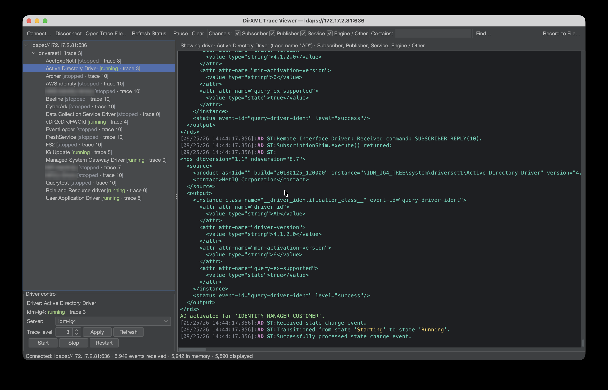

# DirXML Trace Viewer

A desktop viewer for NetIQ / OpenText Identity Manager (IDM) driver trace. It connects to the
Identity Vault over LDAP, discovers driver sets and drivers, and streams DSTrace output live with
syntax coloring. It can also open trace files.



## Features

- **Live trace over LDAP.** Uses the eDirectory event-monitoring extension (the same DSTrace
  events iManager and `ndstrace` see). No SSH or file access to the server is needed.
- **Driver discovery across servers.** Finds every driver set under a search base and connects to
  each server in the driver set's server list. Driver state and trace level are per-server in
  eDirectory, so both are read from, and set on, the server the driver runs on.
- **Driver control.** Start, stop and restart a driver on one server or on all of them, and change
  driver or driver-set trace levels, all over LDAP.
- **Syntax coloring.** Timestamps, driver names and channel tags; XDS/XML tags, attributes and
  values; `<status>` levels (error, warning, success, retry); and the engine's own DSTrace colors.
- **Filtering.** By driver (select it in the tree), by channel (Subscriber `ST`, Publisher `PT`,
  subscriber Service channel `SST`, Engine/Other), and by text ("Contains").
- **Find** in the displayed trace, with every match highlighted.
- **Compact Whitespace.** Hides the blank lines that pad XSLT policy trace.
- **Record to file** as the trace is displayed, or save what is on screen.
- **Open trace files** from the server (drag and drop works too). The same coloring and filters
  apply; large files are fine (tested with 650 MB).
- **Pause** freezes the view while trace keeps being collected, so nothing is lost while you read.

## Requirements

- Java 21 or later (a JRE is enough to run it; a JDK and Maven are needed to build it).
- LDAP or LDAPS access to the Identity Vault server(s), as a user with rights to read the driver
  set and driver objects. Changing trace levels and starting or stopping drivers needs the same
  rights as doing so in iManager or Designer.

## Running

### macOS app (recommended on Mac)

Download `DirXML-Trace-Viewer-<version>-arm64.dmg` from the
[releases](https://github.com/PointBlueTechnology/DirXMLTraceViewer/releases), open it, and drag
**DirXML Trace Viewer** to Applications, or to `~/Applications`, the Desktop, or any other folder if
you don't have admin rights. It includes its own Java runtime, so nothing else needs installing, and
it is signed and notarized by Apple, so it opens without security warnings. It is built for Apple
silicon Macs.

It can use up to half of the Mac's memory, which is plenty for large trace files. To set a
specific limit, start it from Terminal with
`JAVA_TOOL_OPTIONS=-Xmx6g "/path/to/DirXML Trace Viewer.app/Contents/MacOS/DirXML Trace Viewer"`.

### Java launchers (any OS)

Unzip `dirxml-trace-viewer-<version>.zip` and use the launcher for your system:

| System        | Launcher                                                               |
|---------------|------------------------------------------------------------------------|
| macOS         | double-click `dirxml-trace-viewer.command`, or run `./dirxml-trace-viewer.sh` |
| Linux         | `./dirxml-trace-viewer.sh`                                             |
| Windows       | double-click `dirxml-trace-viewer.bat` (add `--console` to see output) |
| Any           | `java -jar dirxml-trace-viewer.jar`                                    |

The launchers find Java through `JAVA_HOME` or the `PATH`, check that it is version 21 or later,
and pass any arguments on to the viewer. Set `JAVA_OPTS` to change JVM options; the default is
`-Xmx2g`. Raise it, e.g. `JAVA_OPTS=-Xmx6g`, to load very large trace files.

macOS may block the `.command` file the first time because it was downloaded. Right-click it and
choose **Open** once, or run `xattr -d com.apple.quarantine dirxml-trace-viewer.command`.

To try the viewer without a server, start it with `--demo`.

## Using it

### Connecting

**File → Connect…** asks for the server, port, bind DN and password (only the password is not
remembered). Options:

- **Use LDAPS** (port 636) or plain LDAP (389).
- **Trust any server certificate.** Accepts self-signed and tree-CA certificates without importing
  them. Convenient for lab servers, but it does not protect against a spoofed server.
- **Allow legacy RSA ciphers** (on by default). Many eDirectory LDAPS listeners only offer
  static-RSA key exchange (e.g. `AES256-GCM-SHA384`), which Java 24 and later disable. Without this
  the TLS handshake fails with "Connection or outbound has closed". These suites lack forward
  secrecy, so turn it off if your servers support ECDHE. Java only reads this setting once, so
  changing it after an LDAPS connection has been made needs a restart.
- **Search base** limits where driver sets are looked for, e.g. `o=system`. Blank searches the
  whole tree.

After connecting, the viewer finds the driver sets, connects to every server in each set's server
list with the same credentials, reads each driver's state and trace level from each server, and
starts a trace stream from each server. If some servers cannot be reached, it says which.

### The driver tree and driver control

Each driver shows its state and trace level per server, e.g. `AD [running · trace 3]` or, with
several servers, `AD [idm1: running · trace 3 | idm2: stopped · trace 0]`.

Select a driver to show only its trace. Select the driver set (or the root) to show everything.

The **Driver control** panel applies to the selected driver or driver set:

- **Server** picks one server, or **All servers** in the driver set.
- **Trace level** + **Apply** writes the trace level on the chosen server(s)
  (`DirXML-TraceLevel` on drivers, `DirXML-DriverTraceLevel` on driver sets).
- **Refresh** re-reads state and trace level; **View → Refresh Status** (F5) refreshes everything.
- **Start / Stop / Restart** use the IDM LDAP extensions; stop and restart ask for confirmation.

A driver with trace level 0 produces no trace. Set it to 3 or higher to see policy processing.

### Viewing trace

- **Channels:** tick Subscriber, Publisher, Service and Engine/Other to choose what is shown.
- **Contains:** shows only messages containing the text (a filter).
- **Find…** (⌘F / Ctrl+F): highlights matches in what is displayed without hiding anything. Enter
  and Shift+Enter step through matches, Esc closes it. Opening Find pauses the view.
- **Pause / Resume:** freezes the view. Trace is still collected (and recorded) meanwhile.
- **View → Compact Whitespace:** hides blank lines. Recorded files keep the original spacing.
- **View → Wrap Lines**, **Auto-Scroll**, and font size (⌘= / ⌘−).
- With more than one server, each message is prefixed with `[server]`.

### Trace files

**File → Open Trace File…** (⌘O / Ctrl+O), or drag a file onto the window. A message starts at
each `[timestamp]:Driver TAG:` line; the lines after it (XML documents, log events) belong to it.
The tree lists the drivers found in the file, and all filters work on the whole file. The view
shows the last messages that match the filter (see Buffer sizes); narrow the filter or raise the
limit to see further back.

### Recording and saving

- **Record to File…** writes the trace as it is displayed, i.e. what passes the current filters,
  to a file. It keeps going while paused.
- **File → Save Displayed Trace As…** saves what is on screen.

### Buffer sizes

**View → Buffer Sizes…** sets:

- **Messages kept in memory** (default 50,000). All drivers, unfiltered, so the view can be
  re-filtered without losing history. While paused nothing is dropped unless the Java heap is
  nearly full. Trace files are always kept whole, heap permitting.
- **Messages shown in the view** (default 15,000). Larger views scroll less smoothly.

### Keyboard shortcuts

⌘ on macOS, Ctrl elsewhere.

| Keys      | Action              | Keys        | Action                |
|-----------|---------------------|-------------|-----------------------|
| ⌘N        | Connect             | ⌘F          | Find                  |
| ⌘O        | Open trace file     | ⌘G / ⇧⌘G    | Find next / previous  |
| ⌘R        | Record to file      | ⌘K          | Clear                 |
| ⌘S        | Save displayed trace| ⌘= / ⌘−     | Larger / smaller font |
| F5        | Refresh status      | ⌘Q          | Exit                  |

## Building

Requires JDK 21+ and Maven. All dependencies come from Maven Central.

```sh
mvn package
```

This produces:

- `target/dirxml-trace-viewer.jar`: the executable jar with all dependencies.
- `target/dirxml-trace-viewer-<version>.zip`: the jar, the launchers, this README, the license and
  third-party notices.

### macOS app

`src/packaging/macos/build-macos-app.sh` builds the signed, notarized app and DMG with a bundled
Java 21 runtime (using `jlink` and `jpackage`). Run it on a Mac after `mvn package`:

```sh
SIGN_IDENTITY="Developer ID Application: Your Name (TEAMID)" \
NOTARY_PROFILE=your-notary-profile \
src/packaging/macos/build-macos-app.sh
```

It needs a Developer ID Application certificate in your keychain and notarization credentials
stored with `xcrun notarytool store-credentials`. Without `NOTARY_PROFILE` it signs but does not
notarize. The output is for the architecture of the JDK used; set `JAVA21_HOME` to choose it.

Driver state and start/stop/restart use the IDM engine's LDAP extended operations (OIDs
`2.16.840.1.113719.1.14.100.13`, `.15`, `.17` and `.101`). The viewer encodes them itself with
JLDAP, so no IDM libraries are needed.

## Troubleshooting

- **"Connection or outbound has closed" or a TLS handshake failure:** enable **Allow legacy RSA
  ciphers** and restart the viewer.
- **Connected, but a driver shows no trace:** check its trace level for the server it runs on,
  and that the right channels are ticked.
- **A server in the driver set shows as unavailable:** the viewer connects to each server at the
  address in its eDirectory `networkAddress`, with the same port and credentials. Start the viewer
  with `JAVA_OPTS="-Ddirxml.debug=true"` to log how each server's address was resolved.
- **Out of memory loading a file:** raise `JAVA_OPTS`, e.g. `-Xmx6g`.

## Project layout

```
src/main/java/com/pointbluetech/dirxml/trace/
  Main.java          entry point (--demo for a synthetic stream)
  ldap/              LDAP connections, discovery, per-server status, driver control, event streams
  model/             DSTrace formatting, trace parsing, highlighting, filters, file reading/writing
  ui/                Swing UI (FlatLaf dark theme)
src/dist/            launch scripts
src/assembly/        distribution zip layout
```

## License

MIT; see [LICENSE](LICENSE).

The executable jar bundles [JLDAP](https://www.openldap.org/jldap/) (OpenLDAP Public License
2.0.1) and [FlatLaf](https://www.formdev.com/flatlaf/) (Apache License 2.0); their copyright notices
and license texts are in [THIRD-PARTY-NOTICES.txt](THIRD-PARTY-NOTICES.txt), which is also included
in the jar and the distribution zip. NetIQ, OpenText, Identity Manager
and eDirectory are trademarks of their respective owners; this project is not affiliated with them.
